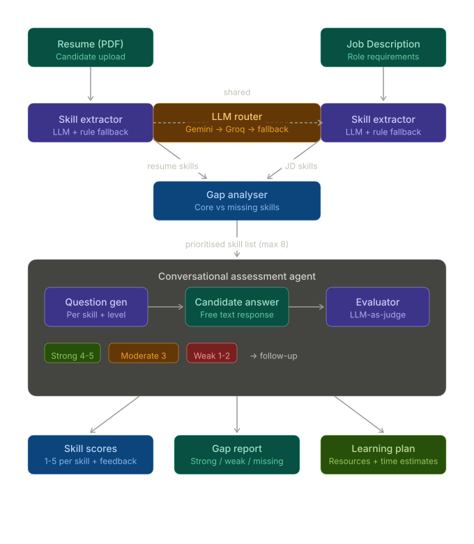

#  SkillX-Ray: AI Skill Assessment Agent

SkillX-Ray is an AI-powered conversational agent that assesses a candidate's real skill proficiency from their resume and a job description — then generates a personalised learning plan to close the gaps.

---

## 🎯 What It Does

Most hiring tools rely on self-reported resumes. This agent goes further:

1. **Parses** a Job Description + candidate Resume
2. **Identifies** skill gaps (what's required vs what the candidate claims)
3. **Conversationally assesses** real proficiency skill-by-skill
4. **Scores** each skill (1–5) with feedback
5. **Generates** a personalised learning plan with free resources + time estimates

---

## 🎥 Demo Video

[▶ Watch Demo on Google Drive](https://drive.google.com/file/d/1eeCTAu1pVC_P0geItKEcfLwqjn1HPbNv/view?usp=drive_link)

---

## 🏗️ Architecture


---

## 🛠️ Tech Stack

| Layer | Technology |
|---|---|
| Frontend | React + Tailwind CSS + Vite |
| Backend | FastAPI + Python |
| PDF Parsing | PyMuPDF |
| LLM (Primary) | Google Gemini 2.5 Flash |
| LLM (Fallback) | Groq — Llama 3.3 70B |
| Deployment | Docker + HuggingFace Spaces |
| Cost | 100% Free |

---

## 💡 Key Design Decisions

- **LLM Fallback Chain** — Gemini 2.5 Flash → Groq Llama 3.3 70B → Gemini Flash Lite → Groq 3.1 8B. If one hits rate limits, next is tried automatically
- **Rule-based clustering** — skills grouped into clusters (Python Stack, Databases, ML etc.) to avoid redundant questions
- **Follow-up cap** — max 2 follow-ups per skill to keep assessment concise
- **0 cost** — no paid APIs, no subscriptions, works entirely on free tiers

---

### Scoring Logic

**Skill Extraction** — LLM extracts skills from JD and resume separately. Falls back to rule-based keyword extractor (60+ skills) if LLM fails.

**Gap Classification** — Skills split into three buckets:
- `core_skills` — in both JD and resume → assessed for depth
- `jd_only_skills` — required but missing → assessed as gaps  
- `resume_only` — ignored for this role

**Question Generation** — Questions generated dynamically per skill at three difficulty levels: easy (basic concepts), medium (scenario-based), hard (trade-offs and edge cases).

**LLM-as-Judge Scoring** — Each answer evaluated by LLM using a structured rubric:
- Score 1-2 → Weak → easy follow-up question triggered
- Score 3 → Moderate → medium follow-up triggered
- Score 4-5 → Strong → move to next skill immediately
- Max 2 follow-ups per skill to prevent infinite loops

**Learning Plan** — Skills scoring below 4 are included in the plan with curated free resources and time estimates. Falls back to hardcoded resources if LLM is unavailable.

---

## 🚀 Local Setup

### Prerequisites
- Python 3.11+
- Node.js 18+
- Gemini API key → [aistudio.google.com](https://aistudio.google.com)
- Groq API key → [console.groq.com](https://console.groq.com)

### Backend

```bash
cd backend
python -m venv venv
venv\Scripts\activate        # Windows
# source venv/bin/activate   # Mac/Linux

pip install -r requirements.txt

# Create .env file
echo GEMINI_API_KEY=your_key_here > .env
echo GROQ_API_KEY=your_key_here >> .env

uvicorn app.main:app --reload
```

### Frontend

```bash
cd frontend
npm install
npm run dev
```

Open [http://localhost:5173](http://localhost:5173)

---

## 📁 Project Structure

```
ai-skill-agent/
├── Dockerfile
├── README.md
├── requirements.txt
├── architecture.svg
│
├── backend/
│   └── app/
│       ├── main.py
│       ├── routes/
│       │   ├── agent.py
│       │   ├── assessment.py
│       │   ├── resume.py
│       │   ├── session.py
│       │   ├── skills.py
│       │   ├── skill_gap.py
│       │   └── results.py
│       └── services/
│           ├── llm_router.py
│           ├── gemini_service.py
│           ├── resume_parser.py
│           ├── skill_extractor.py
│           ├── skill_gap.py
│           ├── agent.py
│           ├── agent_flow.py
│           ├── question_generator.py
│           ├── evaluator.py
│           ├── learning_plan.py
│           └── session_manager.py
│
└── frontend/
    └── src/
        ├── pages/
        │   └── Dashboard.jsx
        └── services/
            └── api.js
```

---

## 📊 Sample Input / Output

### Input
- **Resume**: Data Analyst resume with Python, SQL, Power BI, Pandas
- **JD**: Data Analyst role requiring Python, SQL, Tableau, Statistics, Excel

### Output — Skill Gap
✅ Matched:  python, sql, excel, pandas
❌ Missing:  tableau, statistics

### Output — Assessment Score
Python     → Strong   5/5
SQL        → Weak     1/5
Excel      → Strong   5/5
Pandas     → Strong   4/5
Tableau    → Weak     2/5
Statistics → Moderate 3/5

### Output — Learning Plan
SQL
Topics: SELECT, JOINs, subqueries, aggregations
Resources: sqlzoo.net, youtube.com/HXV3zeQKqGY
Time: 3-4 weeks
Statistics
Topics: mean, median, distributions, hypothesis testing
Resources: Khan Academy, youtube.com/xxpc-HPKN28
Time: 2-3 weeks

---

## ⚠️ Known Limitations

- Session data is stored in-memory — resets on server restart
- Free tier rate limits may trigger model fallback during heavy use
- Assessment quality depends on LLM availability

---

## 📬 Built For

Catalyst Hackathon — AI-Powered Skill Assessment & Personalised Learning Plan Agent

---

## 👨‍💻 Author

**Akshat Srivastava**